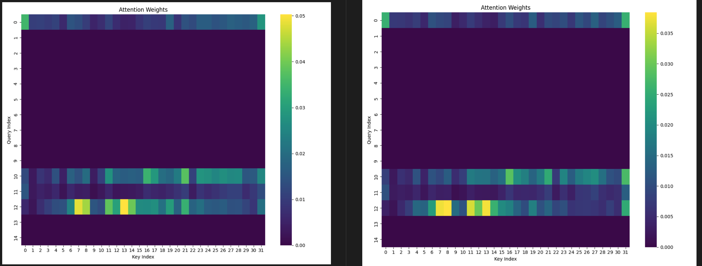
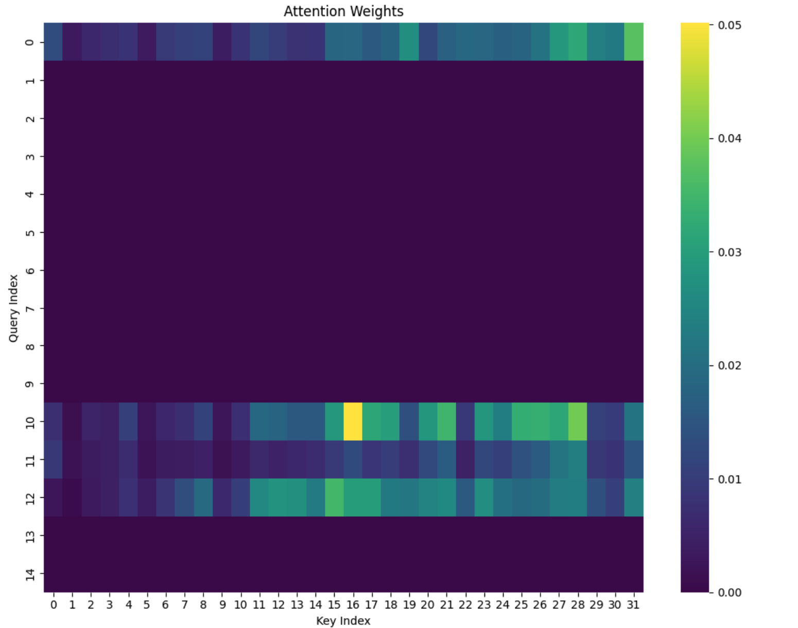

# OminousLLM

Inspired by GPT-4o

## Preprocess

Segment-any-text: https://github.com/segment-any-text/wtpsplit

## Pilot-Experiment

- long-context alignment

LongVA replication

| model | short | medium | long  | overall |
| ----- | ----- | ------ | ----- | ------- |
| Direct |   61.78    |  53.0      | 45.67     |   53.48      |
| DPO   | 58.89 | 51.67  | 43.89 | 51.48   |
|       |       |        |       |         |

- last commit 9.12

data replay

| model  | short | medium | long | overall |
| ------ | ----- | ------ | ---- | ------- |
| LongVA-Report |   61.1    |  48.8      |  45.4    |   52.4      |
| +10k   |   60.89    |    50.67    |   45.0   |   52.18      |
|  +1k |  60.44  |  50.44     |  42.77      |  51.22    |         |
| +10k-rev-pre   |    60.89   | 51.11       |  43.67    |  51.89       |
| +10k-rev-rev   |   1.11    |   0.78     |   1.89   | 1.26        |
| +100k  |   58.56    |    47.89    |  42.22    |  49.55       |
| +100k-rev-pre   |    59.56   | 49.56       |  43    |  50.70       |

## Experiment

- Medusa: acceptance (https://blog.codingconfessions.com/p/a-selective-survey-of-speculative-decoding)

$$
\begin{align*}
&p_{\text{original}}(x_{n+k} \mid x_1, x_2, \cdots, x_{n+k-1}) >
\min \left( \epsilon, \delta \exp \left( -H\left( p_{\text{original}} (\cdot \mid x_1, x_2, \cdots, x_{n+k-1}) \right) \right) \right)
\\
\\
&\text{Where:}
\\
   &p_{\text{original}}\text{: Probability of the n+kth token from the base model}
\\
&\epsilon:\text{Hard threshold}
\\
&\delta\text{: Entropy-dependent threshold}
\\
&H(\cdot)\text{: The entropy function}
\end{align*}
$$

- Enabling Real-Time Conversations with Minimal Training Costs

  - parallel decoding: model generates tokens autoregressively while simultaneously processing the input token. (sync input processing and generation)
  - channel transition: mask (lookahead: 1 forward get parallel results)

- Training

1. interleaved training (left: before, right: after)

when we increase the training set to 100k, we get worse performanc

2. descern noise

- noise with special token
- stop words with eos

## Trial (legacy)

- data collection (with shenzhi)
  - data download: youtube with [100 keywords](preprocess/keywords.md)
- multi-task instruction tuning (with shenzhi)
  1. temporal sentence grouding in dialogue (timestamp -> dialogue). f"{timestamp}: {asr}"
  2. temporal sentence grouding in caption: (timestamp -> caption). f"{timestamp}: {caption}"
  3. caption to dialogue. f"When the description of the video clip is {caption}, what's the speech: {asr}"
  4. dialogue to caption. f"Please describe the video clip when someone is saying {asr}: {caption}"

three keypoints for streaming llm

1. discern query and noise
2. duplex support

- streaming training: inject interactive ability of existing vlm

  - narration ability: scene transition
  - silence ability: random choice with eos
- audio aiblity

  - depth transformer or llama-omini()
  - duplex
