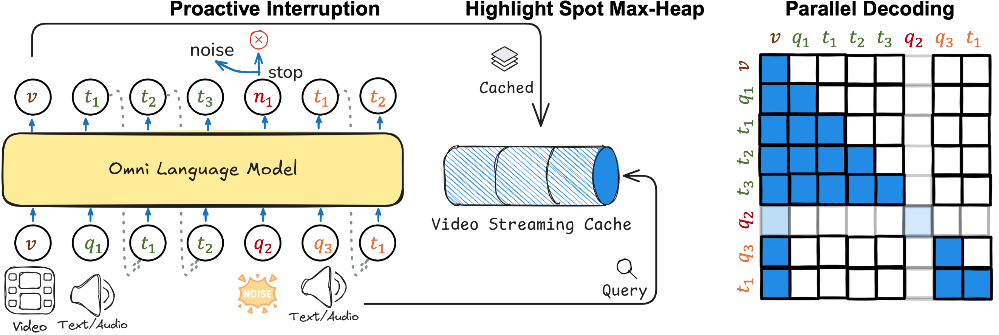

<h1 align="center">Multi-modal Multiplexing Modeling</h1>
<p align="center">
    <a href="https://arxiv.org/abs/xxxx.xxxxx">
            
    </a>
    <a href="https://huggingface.co/ColorfulAI/M4-LongVA-7B-Qwen2">
        
    </a>
    <a href="https://huggingface.co/ColorfulAI/M4-Audio-LongVA-7B-Qwen2">
        
    </a>
    <a href="https://huggingface.co/datasets/ColorfulAI/M4-IT">
        
    </a>
</p>

<!-- [](https://<CONFERENCE>) -->



## Updates

<!-- - [] Paper Release, check it on [Arxiv](https://arxiv.org/pdf/xxxx.xxxxx.pdf).  -->

- **First Release [M4](https://github.com/patrick-tssn/M4)**. M4 enables multiplexed modeling capabilities for a visual language model at minimal cost.

**Table of Contents**

- [M4](#m4)
  - [Introduction](#introduction)
  - [M4-IT](#dataset)
- [Train](#training)
  - [Installation](#installation)
  - [Data Preparation](#data-preparation)
  - [Backbone Preparation](#pretrained-backbone-preparation)
  - [Start Training](#training-1)
- [Usage](#usage)
- [Evaluation](#evaluation)

## M4

### Introduction

We introduce Multimodal Multiplexing Modeling (M4), a framework that enhances real-time interactive reasoning with minimal fine-tuning on pre-trained MLLMs.

- **M4-IT Dataset**: A synthetic instruction finetuning dataset with components interleaved image-text instruction, noise instruction, and stop instruction.
- **M4 Model**: Enhances proactive response generation, assesses new queries against noise, by enabling parallel decoding.

### M4-IT Dataset

Building on the [LLaVA-NeXT-Data](https://huggingface.co/datasets/lmms-lab/LLaVA-NeXT-Data), we crafted a small video-free synthetic instruction finetuning dataset, M4-IT, with the assistance of GPT-4o. M4-IT comprises four components:

- the original instruction, which is a data replay from the instruction data of our base model
- interleaved image-text instruction, which is created by reordering the question and image components of the original instruction
- noise instruction, where GPT-4 is prompted to automatically generate statements that do not require a response
- stop instruction, where GPT-4 is prompted to generate stop phrases for the stop instruction

In addition, to assist with audio instruction tuning, we convert user queries into audio using [CosyVoice](https://github.com/FunAudioLLM/CosyVoice), with a randomly selected [VoiceAssistant](https://huggingface.co/datasets/gpt-omni/VoiceAssistant-400K) as a prompt.

**Data Statistics**

The M4-IT dataset comprises a total of 9,963 instructions. The distribution across different categories is as follows:

| Category   | Count |
| ---------- | ----- |
| Original   | 2,624 |
| Interleave | 2,376 |
| Noise      | 2,563 |
| Stop       | 2,500 |

Data sample

```json
    {
        "id": "000000240632",
        "image": "000000240632.jpg",
        "conversations": [
            {
                "from": "human",
                "value": "<image>\n"
            },
            {
                "from": "human",
                "value": "<speech>\n" # provide the bounding box coordinates of the region that the given sentence describes
            },
            {
                "from": "gpt",
                "value": "[0.280,0.194,0.628,0.824]"
            },
            {
                "from": "human",
                "value": "<speech>\n" # Could I stop you for a second?
            },
            {
                "from": "gpt",
                "value": "<|im_end|>"
            }
        ],
        "speech": [
            "000000240632_0.wav",
            "000000240632_1.wav"
        ]
    },
```

If you are interested in the process of the construction of audio instruction, you can refer to the scripts in `preprocess/tts`

## Training

### Installation

This codebase is tested on CUDA 11.8 and A800-80G.

```bash
conda create -n intersuit python=3.10 -y && conda activate intersuit
pip install torch==2.1.2 torchvision --index-url https://download.pytorch.org/whl/cu118
pip install -e "intersuit/.[train]"
pip install packaging &&  pip install ninja && pip install flash-attn==2.5.0 --no-build-isolation --no-cache-dir
pip install -r requirements.txt
```

*optional*

- [ChatTTS](https://github.com/2noise/ChatTTS)
- [CosyVoice](https://github.com/FunAudioLLM/CosyVoice)

### Data Preparation

Download [M4-IT](https://huggingface.co/datasets/ColorfulAI/M4-IT) and organize it in the following format. To enhance audio instruction-following performance, you may also download [VoiceAssistant-400K](https://huggingface.co/datasets/gpt-omni/VoiceAssistant-400K) and sample a portion of this dataset based on your computational resources.

```
intersuit/inputs          
    ├── images/ # images
      └── llava-next/
        ├── ...
        └── xxxx.jpg
    ├── speech/
      ├── voiceassistant/
        ├── ...
        └── xxxx.wav
      └── interinst/
        ├── ...
        └── xxxx.wav
    └── texts/
      ├── voiceassistant.json
      ├── m4-it-qwen.json
      └── m4-it-qwen-audio.json
```

### Pretrained Backbone Preparation

Download the pretrained large video language model weights [LongVA-7B](https://huggingface.co/lmms-lab/LongVA-7B) and the pretrained audio encoder weights [Whisper](https://github.com/openai/whisper), and place them in the `intersuit/checkpoints` directory.

```
intersuit/checkpoints          
    ├── LongVA-7B-Qwen2
    └── whisper/large-v3.pt
```

If you wish to use other LLMs or instruction tuning data, feel free to follow the [LLaVA-NeXT](https://github.com/LLaVA-VL/LLaVA-NeXT) pipeline. Here, we provide a pipeline to do visual instruction tuning on [Llama-3.1-8B](https://huggingface.co/meta-llama/Llama-3.1-8B-Instruct/tree/main) using the datasets [blip_laion_cc_sbu_558k](https://huggingface.co/datasets/liuhaotian/LLaVA-Pretrain), [LLaVA-NeXT-Data](https://huggingface.co/datasets/lmms-lab/LLaVA-NeXT-Data), and [ShareGPTVideo](https://huggingface.co/datasets/ShareGPTVideo/train_video_and_instruction). Feel free to adapt it to other models.

```bash
bash lvlm_pretrain.sh
bash lvlm_finetune.sh
bash lvlm_dpo.sh
```

### Start Training

Our training logic is essentially the same as the visual instruction tuning. (The training process takes ~2 hours on 4 NVIDIA A800-80G)

```bash
cd intersuit
# finetune on m4-it
bash scripts/finetune_m4.sh
# finetune on m4-it-audio
bash scripts/finetune_m4_audio.sh
```

Before fine-tuning the audio version, you are encouraged to tune the vision-language model on audio instructions to improve the generality of audio understanding. (This process takes ~100 hours on 4 A800 GPU)

```bash
bash scripts/finetune_voiceassistant.sh
```

To assist those with limited computational resources, we also provide an off-the-shelf checkpoint. Check it out at [](https://huggingface.co/ColorfulAI/LongVA-7B-Qwen2-VoiceAssistant)

To enhance the model's visual-audio understanding capabilities, we offer a script to fine-tune it using the [LLaVA-NeXT-Audio](https://huggingface.co/datasets/ColorfulAI/LLaVA-NeXT-Audio) dataset. This aims to improve visual-audio alignment performance. (This process takes ~140 hours on 4 A800 GPU)

```bash
bash scripts/finetune_llavanextaudio.sh
```

For those with limited computational resources, we also provide a ready-to-use checkpoint. You can access it here [](https://huggingface.co/ColorfulAI/LongVA-7B-Qwen2-Audio)

Try the visual-audio base model through `python -m local_demo.baseline_audio_cli --video_path local_demo/assets/water.mp4 --question_audio "local_demo/wav/water.mp4.wav"`

## Usage

Currently, we only provide a demo, but you are welcome to deploy it using your preferred framework.

(i) attention-based proactive reasoning

```bash
cd intersuit
python -m local_demo.proactive_cli  --model_path M4-LongVA-Qwen-7B --frame_fps 1 --video_file local_demo/assets/water.mp4
```

(ii) multiplexing modeling

*text input*

```bash
cd intersuit
# new valid query
python -m local_demo.turntaking_cli --video_path local_demo/assets/water.mp4 --question "Can you describe the video?" --new_query "How many people in the video?" --new_query_pos 20
# new interrupt query
python -m local_demo.turntaking_cli --video_path local_demo/assets/water.mp4 --question "Can you describe the video?" --new_query "Sorry to interrupt?" --new_query_pos 20
# new noise query
python -m local_demo.turntaking_cli --video_path local_demo/assets/water.mp4 --question "Can you describe the video?" --new_query "Okay, I see." --new_query_pos 20
```

*audio input*

For better visualization, you can input text, and ChatTTS will automatically convert it into audio. You can then find the generated audio in `local_demo/wav`.

```bash
cd intersuit
# new valid query
python -m local_demo.turntaking_audio_cli --video_path local_demo/assets/water.mp4 --question "Can you describe the video?" --new_query "How many people in the video?" --new_query_pos 20
# new interrupt query
python -m local_demo.turntaking_audio_cli --video_path local_demo/assets/water.mp4 --question "Can you describe the video?" --new_query "Sorry to interrupt?" --new_query_pos 20
# new noise query
python -m local_demo.turntaking_audio_cli --video_path local_demo/assets/water.mp4 --question "Can you describe the video?" --new_query "Okay, I see." --new_query_pos 20
```

or you can specify the audio

```bash
cd intersuit
python -m local_demo.turntaking_audio_cli --video_path local_demo/assets/water.mp4 --question_audio "XXX.wav" --new_query_audio "XXX.wav" --new_query_pos 20
```

## Evaluation

To evaluate the interaction ability of **M4** in streaming video contexts, you are encouraged to try our [OmniMMI](https://github.com/bigai-nlco/OmniMMI)!

## Acknowledgement

We Thank [LLaVA-NeXT](https://github.com/LLaVA-VL/LLaVA-NeXT), [LongVA](https://github.com/EvolvingLMMs-Lab/LongVA), [videollm-online](https://github.com/showlab/videollm-online), [LLaMA-Omni](https://github.com/ictnlp/LLaMA-Omni) for open-sourcing their work.

## Citation

If you find our work helpful, please consider citing it.

```bibtex
@article{omnimmi,
    title={OmniMMI: A Comprehensive Multi-modal Interaction Benchmark in Streaming Video Contexts},
    author={Wang, Yuxuan and Wang, Yueqian and Chen, Bo and Wu, Tong and Zhao, Dongyan and Zheng, Zilong},
    journal={arxiv},
    year={2025}
}
```
