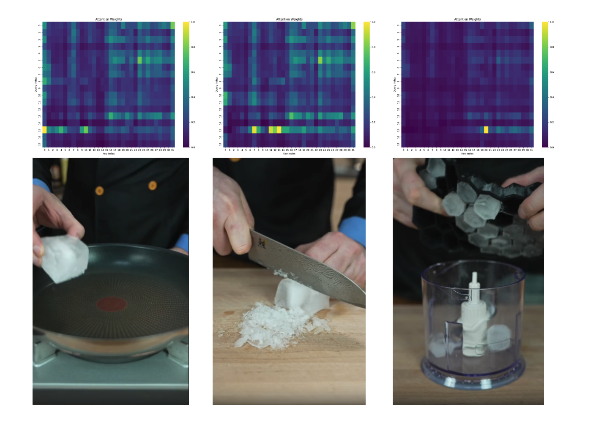
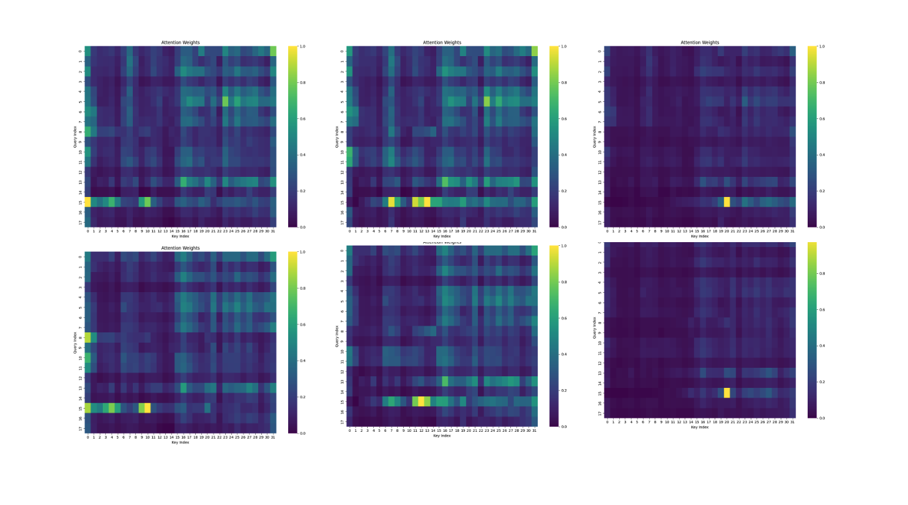

# OminousLLM

Inspired by GPT-4o

## Preprocess

Segment-any-text: https://github.com/segment-any-text/wtpsplit

## Pilot-Experiment

- long-context alignment

LongVA replication

| model          | short | medium | long  | overall |
| -------------- | ----- | ------ | ----- | ------- |
| Direct         | 61.78 | 53.0   | 45.67 | 53.48   |
| DPO            | 58.89 | 51.67  | 43.89 | 51.48   |
| qwen2.5-ft     | 59.89 | 46.89  | 44.0  | 50.26   |
| qwen2.5-ft-dpo | 59.67 | 46.89  | 43.56 | 50.04   |
| llama3.1-ft    | 56.11 | 42.22  | 36.44 | 44.93   |
| llama3.1-sub    | 55.22 | 43.00  | 37.11 | 45.11   |
| llama3.1-mix    | 54.33 | 40.22  | 36.00 | 43.52   |

- last commit 9.12

data replay

| model         | short | medium | long  | overall  |
| ------------- | ----- | ------ | ----- | -------- |
| LongVA-Report | 61.1  | 48.8   | 45.4  | 52.4     |
| +10k          | 60.89 | 50.67  | 45.0  | 52.18    |
| +1k           | 60.44 | 50.44  | 42.77 | 51.22    |
| +10k-rev-pre  | 60.33 | 50.56  | 43.89 | 51.59    |
| +10k-rev-rev  | 48.78 | 44     | 36.89 | 43.22    |
| +100k         | 59.11 | 49     | 43.33 | 50.48    |
| +100k-rev-pre | 59.56 | 49.56  | 43    | 50.70    |
| +100k-rev-rev | 50.33 | 43.89  | 39.11 | 44.44    |
| +10k-noise    | 60.33 | 51.44  | 45.67 | 52.48    |
| +10k-stop     | 60.33 | 50.78  | 44    | 51.70 |
| +RNS (30k)     |  |  |     | 50.?? |
| +ORNS (40k)    |  |  |     | 50.?? |
| +RNS211 (20k)    | 60.22 | 49.67  |  44.89   | 51.59 |
| +ORNS1111 (10k)    | 60.56 | 50.78  |  43.89   | 51.74 |
| +ORNS2111 (25k)    | 58  | 49.11 | 44.89    | 50.67  |
| +RNS211 (10k)    | 59 | 51.44 | 44.11    |51.52  |
| +NRS211 (10k)    | 61.11 | 51.33 |  43.44   | 51.96 |

grounding
ORNS1111: 24
RNS211: 20.5

## Experiment

- Medusa: acceptance (https://blog.codingconfessions.com/p/a-selective-survey-of-speculative-decoding)

$$
\begin{align*}
&p_{\text{original}}(x_{n+k} \mid x_1, x_2, \cdots, x_{n+k-1}) >
\min \left( \epsilon, \delta \exp \left( -H\left( p_{\text{original}} (\cdot \mid x_1, x_2, \cdots, x_{n+k-1}) \right) \right) \right)
\\
\\
&\text{Where:}
\\
   &p_{\text{original}}\text{: Probability of the n+kth token from the base model}
\\
&\epsilon:\text{Hard threshold}
\\
&\delta\text{: Entropy-dependent threshold}
\\
&H(\cdot)\text{: The entropy function}
\end{align*}
$$

> Motivation:
> (1) Tokens with high probability should be accepted
> (2) When the entropy is high, various possible continuations should be acceptable
> When verifying a continuation, each token is verified using the above criteria and the continuation with the longest accepted prefix is accepted.
> To build intuition about this scheme, consider the following cases:
> (1)When the temperature is 0, any token with probability greater than the threshold ϵ will be accepted. This means only the tokens matching closely with the base LLM’s predictions will be accepted.
> (2)When the temperature value is increased, depending on the value of ϵ, and δ, more diverse tokens will be accepted, leading to an overall increased acceptance rate of the speculatively produced tokens.
> The paper also notes that they always accept the first token greedily, i.e. they accept the most probable token for the first position, while they apply the above scheme on the rest of the tokens. This means that in the worst case they are at least producing one token.

- Enabling Real-Time Conversations with Minimal Training Costs

  - parallel decoding: model generates tokens autoregressively while simultaneously processing the input token. (sync input processing and generation)
  - channel transition: mask (lookahead: 1 forward get parallel results)
- Training

1. interleaved training (left: before, right: after)

--> TODO: descern now or future question? now, we believe this is the user intention

when we increase the training set to 100k, we get worse performanc

with rev: <|im_start|> can ground to the related frames

variable length



comparison with LongVA (uppper: rev; lower: LongVA)



- stop words with eos

'<|im_start|>system\nYou are a helpful assistant.<|im_end|>\n<|im_start|>user\n\nplease notify me when the man hold a knife<|im_end|>\n<|im_start|>assistant\n'

2. stop words:

user prompt: sorry to interrupt

LongVA: "It looks like you've shared a video...
longva-stop: '<|im_end|>'

3. noise detection:

user prompt: So, This video is about the cooking.

LongVA: "It looks like you've shared a video...
longva-noise: '<|im_start|><|im_end|>'

user prompt: Can you describe the video?
longva-noise: 'Thie video appears to be a cooking...'


```
import torch
from transformers import AutoTokenizer, AutoModelForCausalLM, DynamicCache

model_id = "/scratch2/nlp/plm/Qwen2-7B-Instruct"
model = AutoModelForCausalLM.from_pretrained(model_id, torch_dtype=torch.bfloat16, device_map="cuda:0")
tokenizer = AutoTokenizer.from_pretrained(model_id)

past_key_values = DynamicCache()
messages = [{"role": "user", "content": "Hello, what's your name."}]
inputs = tokenizer.apply_chat_template(messages, add_generation_prompt=True, return_tensors="pt", return_dict=True).to("cuda:0")

generated_ids = inputs.input_ids
cache_position = torch.arange(inputs.input_ids.shape[1], dtype=torch.int64, device="cuda:0")
max_new_tokens = 10

for _ in range(max_new_tokens):
    outputs = model(**inputs, cache_position=cache_position, past_key_values=past_key_values, use_cache=True)
    # Greedily sample one next token
    next_token_ids = outputs.logits[:, -1:].argmax(-1)
    generated_ids = torch.cat([generated_ids, next_token_ids], dim=-1)
    # Prepare inputs for the next generation step by leaaving unprocessed tokens, in our case we have only one new token
    # and expanding attn mask for the new token, as explained above
    attention_mask = inputs["attention_mask"]
    attention_mask = torch.cat([attention_mask, attention_mask.new_ones((attention_mask.shape[0], 1))], dim=-1)
    inputs = {"input_ids": next_token_ids, "attention_mask": attention_mask}
    cache_position = cache_position[-1:] + 1 # add one more position for the next token

print(tokenizer.batch_decode(generated_ids, skip_special_tokens=True)[0])
```


BUG: omission now

sdpa -> eager: this will cause nan in the attention weight

## Trial (legacy)

- data collection (with shenzhi)
  - data download: youtube with [100 keywords](preprocess/keywords.md)
- multi-task instruction tuning (with shenzhi)
  1. temporal sentence grouding in dialogue (timestamp -> dialogue). f"{timestamp}: {asr}"
  2. temporal sentence grouding in caption: (timestamp -> caption). f"{timestamp}: {caption}"
  3. caption to dialogue. f"When the description of the video clip is {caption}, what's the speech: {asr}"
  4. dialogue to caption. f"Please describe the video clip when someone is saying {asr}: {caption}"

three keypoints for streaming llm

1. discern query and noise
2. duplex support

- streaming training: inject interactive ability of existing vlm

  - narration ability: scene transition
  - silence ability: random choice with eos
- audio aiblity

  - depth transformer or llama-omini()
  - duplex
